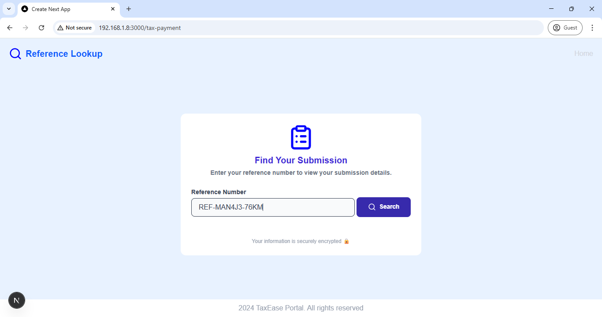

# Tugas PPL Software Testing
Testing yang dilakukan meliputi
- White Box Testing
  
  Berfokus pada pengujian perilaku internal perangkat lunak yang dilakukan dengan pengujian fungsi dan modul di dalamnya. Pada pengujian ini Tester **`mengetahui`** sumber kode internal dari software. Pengujian ini disertai dengan testing keluaran dari sebuah fungsi dan perilaku algoritma dalam kode.

- Black Box Teting

  Berfokus pada pengujian perilaku eksternal dari sebuah perangkat lunak dimana pengujian dilakukan dengan tujuan untuk memastikan software bekerja sesuai dengan kebutuhan pengguna. Pengujian ini **`tidak memerlukan`** Tester untuk mengathui sumber kode internal dari software.

## User Reqierements

### Probelm 1 `[p.1]`
User memerlukan sebuah platform untuk membayarkan pajak, sesuai keperluan mereka dimana keperluan mereka diantaranya adalah pembayaran pajak:
  - pajak penghasilan
  - pajak kendaraan
  - pajak properti
  - pajak bisnis

### Probelm 2 `[p.2]`
User memerlukan sebuah platform yang dapat melakukan tracking untuk hasil pembayaran pajak yang telah dilakukan.

## Feature Software

### Submission Tax `[f.1]`

  Page untuk melakukan transaksi pembayaran pajak untuk: 
   - pajak penghasilan
   - pajak kendaraan
   - pajak properti
   - pajak bisnis
  
  Page ini menyelesaikan `[p.1]` dengan solusi `memberikan platform untuk pembayaran pajak sesuai dengan keperluan mereka`.

### Receipt Tax `[f.2]`

  Page untuk memberikan status mengenai keberhasilan pembayaran pajak yang telah dilakukan disediakan di feature 1 / `[f.1]`. Pada page ini user dapat melihat: 
   - refrence id yang berbeda untuk invoice pajak mereka
   - jenis pajak yang telah mereka bayarkan
   - jumlah uang yang telah dibayarkan untuk pajak mereka tanggung
   - kapan pajak telah dibayarkan

   Page ini memberikan solusi untuk `[p.2]`, dimana user dapat melihat hasil dan bukti pembayaran pajak mereka, tetapi belum menyelesaikan masalah user, ketika user ingin melihat saja tanpa harus membayar pajak

### Tax-Payment `[f.3]`
  Page ini digunakan untuk keperluan tracking pajak yang telah dibayarkan oleh user. Feature ini akan mencari invoice pembayaran pajak dan akan menampilkan `[f.2]` sehingga `user dapat mengetahui dan tracking hasil pembayaran pajak mereka`, yang merupakan solusi dari `[p.2]`.

### Solution Provided by Software Feature

Untuk dapat menjamin solusi yang disediakan:
- **Menyediakan Submission Tax Payment** untuk pembayaran pajak user `[s.1]`
- **Menyediakan Search Invoice Tax** untuk tracking user tax invoice `[s.2]`

## Testing 

Untuk memastikan bahwa `[s.1]` dan `[s.2]` dapat berjalan dengan baik, maka dilakukan software testing yang terdiri dari black-box testing **[end-to-end test]** dan white-box testing **[unit test]**.

### White Testing Result

  |File|% Stmts|% Branch|% Funcs|% Lines|Uncovered Line('s)|
  |-|-|-|-|-|-|
  |All files                 |   19.89 |     7.36 |    9.45 |      78 |      |
  | api/receipt/[ref_num]    |   86.66 |    66.66 |     100 |   86.66 |      |                                         
  |  route.ts                |   86.66 |    66.66 |     100 |   86.66 | 30-31|                                         
  | api/submission           |     100 |      100 |     100 |     100 |      |                                         
  |  route.tsx               |     100 |      100 |     100 |     100 |      |                                         
  | components               |     100 |       70 |     100 |     100 |      |                                         
  |  CustomButton.tsx        |     100 |    57.14 |     100 |     100 | 25-31|                                         
  |  CustomInput.tsx         |     100 |      100 |     100 |     100 |      |                                         
  |  ReceiptTable.tsx        |     100 |      100 |     100 |     100 |      |                                         
  |  TaxTypeDropdown.tsx     |     100 |      100 |     100 |     100 |      |                                         
  | generated/prisma         |      90 |    42.85 |       0 |      90 |                                                
  |  index.js                |      90 |    42.85 |       0 |      90 | 166-176 |
  | generated/prisma/runtime |   17.72 |     6.83 |    8.41 |      54 |       |                                  
  <!-- |  library.js              |   17.72 |     6.83 |    8.41 |      54 | 14,18-22,25-27,38-60,68,72-104,115-116,126-129 | -->
  | submission               |   61.11 |     62.5 |      80 |   61.11 |       |
  |  page.tsx                |   61.11 |     62.5 |      80 |   61.11 | 32-64,91 |
  | tax-payment              |     100 |      100 |     100 |     100 |          |
  |  page.tsx                |     100 |      100 |     100 |     100 |          |
  | utils                    |     100 |      100 |     100 |     100 |          |
  | generateRefNum.ts       |     100 |      100 |     100 |     100 |          |

  ```
  Test Suites: 9 passed, 9 total
  Tests:       35 passed, 35 total
  Snapshots:   0 total
  Time:        7.919 s
  ```

### Black Testing Result

##### Testing `[f.1]`
Menunjukan component dan page berhasil dirender dengan baik dan bekerja sesuai dengan kebutuhan user pada `[p.1]`.


##### Testing `[f.2]`
Hasil dari invoice pembayaran pajak ketika page 1 berhasil terjadi transaksi.


##### Testing `[f.3]`
Page pencarian invoice pembayaran pajak untuk menyelesaikan masalah `[p.2]` yang dialami oleh user. Pada page ini user dapat kembali dengan mengklik Home di bagian atas kanan page.

Ini adalah ketika invoice berhasil ditemukan, menampilkan refrence id, jenis pajak yang dibayarkan, jumlah pajak yang dibayarkan dan waktu pembayaran pajak.

Ini adalah ketika invoice tidak berhasil ditemukan.


##### Testing API 1


#### Testing API 2


## Link PPT
https://www.canva.com/design/DAGn2uxdAqk/KMqgh5M2t1VLzR3K9cdR5A/edit?utm_content=DAGn2uxdAqk&utm_campaign=designshare&utm_medium=link2&utm_source=sharebutton
